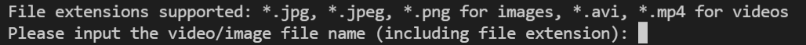

# Detecting Vessels and Kayaks using YOLOv3

This repository is forked from Ultralytics' implementation of YOLOv3 (an object detection model) and is catered towards Vessel and Kayak Detection. This guide assumes that you have basic knowledge of Python. 

**Please read the next few sections carefully before using this repository.**

## Downloading of Weights for Vessel and Kayak Detection
**The model weights need to be downloaded from the below link and stored in the `yolov3` folder after cloning this repository.**
Due to Github's file size limit of 100MB, the weights, **`best.pt`**, need to be downloaded from **[here](https://drive.google.com/file/d/1hgV7DGNPtnOMsAjWPQ47jEooxIBjC2lg/view?usp=sharing)**.

## Setting up of Virtual Environment (Windows)
To download all the required packages to use the repository and prevent dependency conflicts, a virtual environment is required. 
This is a very basic guide on how to create virtual environments in Windows using the `venv` library will be demonstrated below. 

For Mac/Linux users, please refer to this [link](https://packaging.python.org/guides/installing-using-pip-and-virtual-environments/) instead.

### Step One: Creating a Virtual Environment
Before running, we can change the directory to the path where the `yolov3` repository is located in your computer.
Run `python -m venv \path\to\myenv` using Command Prompt.

Example: `python -m venv YourVirtualEnvironment`, where `YourVirtualEnvironment` is the name of the environment. 

### Step Two: Activating your Virtual Environment 
Run `\path\to\myenv\Scripts\activate` using Command Prompt.

Example: `YourVirtualEnvironment\Scripts\activate`, where `YourVirtualEnvironment` is the name of the environment. 

### Step Three: Installing Packages in Virtual Environment 
**Remember to activate your virtual environment first**.

Run `pip install -r requirements.txt` using Command Prompt.

You now have the necessary packages needed to use the repository. 

## Detecting Vessels and Kayaks in an Image or Video
**Before using the repository, ensure that you have activated your virtual environment and also changed directories to the path where the `yolov3` repository is stored in your machine.**

**You have the choice of either processing an image or video. The image/video and `.json` file (optional) must be in the `yolov3` folder.** 

File extensions supported: `*.jpg`, `*.jpeg`, `*.png` for images, `*.avi` for videos.

### Using an Image
Make a spare copy of it beforehand, as the **unprocessed image will be overwritten by the processed one in the same folder**. 

The outputs of processing an image would be: 
1. The processed image with the same filename
2. A `.csv` file with the name `OutputCSV.csv`. It contains the following information:
   * image_name
   * Total number of vessels
   * Total number of kayaks
   * Coordinates of bounding boxes for vessels
   * Coordinates of bounding boxes for kayaks

The coordinates for vessels and kayaks are defined as such:

Both outputs will be in the `yolov3` folder.  

### Using a Video
**The original video will not be overwritten by the processed video.** **You have the option to include a `.json` file stating the (additional) frames you would like to infer. These frames from the input video will be included in the final processed video. Like an image, the output information after processing the frames listed in the `.json` file will be collected and stored in a `.csv` file.**

**Note: The `.json` file must be formatted as such, where the only key of the dictionary MUST be `frames_to_infer` and its corresponding value is a list of the frame indexes of the frames to infer.** In the below case, the frames to infer are frames 20, 24, 30, 44, 66, and 88.

The outputs of processing a video would be:
1. The processed video with the name `OutputVideo.avi`.
2. **If a `.json` file was used**, a `.csv` file with the name `OutputCSV.csv` will be produced as well. It contains the following information for each frame:
    * frame index (number)
    * Total number of vessels
    * Total number of kayaks
    * Coordinates of bounding boxes for vessels
    * Coordinates of bounding boxes for kayaks

The output(s) will be located in the `yolov3` folder as well.

### Inference

Run `python vessel_kayak_count.py` on your terminal. You will see the following display on your console:

Input the name (including file extension) of the image/video that you want processed (and press Enter).

Example: `YourImage.jpg` for images, `YourVideo.avi` for videos.

If the input is a **video**, you can choose whether to include an `.json` file as an additional input by typing either `Y` or `N` (and press Enter).

If `Y` is selected, then you can input the additional `.json` file (including file extension), then press Enter. Otherwise, inference will be done only on some frames. The frames chosen are such that the time taken to complete the inference (inclusive of time taken to extract frames from the unprocessed video and producing the outputs) are less than twice the duration of the video, i.e. a 15 second video should take 30 seconds for the aforementioned processes to be completed. The time taken will be displayed on the console.

The outputs should be produced after running the `vessel_kayak_count.py` file. 

