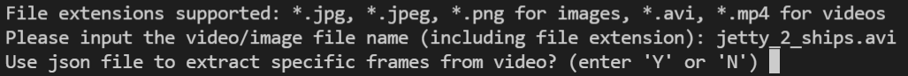

# Detecting Vessels and Kayaks using YOLOv3

This repository is forked from Ultralytics' implementation of YOLOv3 (an object detection model) and is catered towards Vessel and Kayak Detection. This guide assumes that you have basic knowledge of Python. 

We provide two methods of performing detection:

1. Virtual Environment
2. Docker

We recommend trying the Method 1 (Virtual Environment) first instead of Docker because the latter takes substantially long to create the Docker image.

**Please read the next few sections carefully before using this repository.**

## Downloading of Repository
You can either download the repository in a zip folder and unzip it, or you can run `git clone https://github.com/leongjwm/yolov3.git` on your terminal. You might need to download Git for the latter from this [link](https://git-scm.com/download).

## Downloading of Weights for Vessel and Kayak Detection
**The model weights need to be downloaded from the below link and stored in the `yolov3` folder after cloning this repository.**
Due to Github's file size limit of 100MB, the weights, **`best.pt`**, need to be downloaded from **[here](https://drive.google.com/file/d/1hgV7DGNPtnOMsAjWPQ47jEooxIBjC2lg/view?usp=sharing)**.

## Method 1: Virtual Environment: Setting Up (Windows)
To download all the required packages to use the repository and prevent dependency conflicts, a virtual environment is required. 
This is a very basic guide on how to create virtual environments in Windows using the `venv` library will be demonstrated below. 

For Mac/Linux users, please refer to this [link](https://packaging.python.org/guides/installing-using-pip-and-virtual-environments/) instead.

### Step One: Creating a Virtual Environment
Before running, we can change the directory to the path where the `yolov3` repository is located in your computer.
Run `python -m venv \path\to\myenv` using Command Prompt.

Example: `python -m venv YourVirtualEnvironment`, where `YourVirtualEnvironment` is the name of the environment. 

### Step Two: Activating your Virtual Environment 
Run `\path\to\myenv\Scripts\activate` using Command Prompt.

Example: `YourVirtualEnvironment\Scripts\activate`, where `YourVirtualEnvironment` is the name of the environment. 

### Step Three: Installing Packages in Virtual Environment 
**Remember to activate your virtual environment first**.

Run `pip install -r requirements.txt` using Command Prompt.

You now have the necessary packages needed to use the repository. 

## Virtual Environment: Detecting Vessels and Kayaks in an Image or Video
**Before using the repository, ensure that you have:**

**1. Activated your virtual environment and moved the downloaded model weights to the `yolov3` folder.**

**2. Changed directories to the path where the `yolov3` repository is stored in your machine.**

**3. You have the choice of either processing an image or video. The image/video and `.json` file (optional) must be in the `yolov3` folder.** 

File extensions supported: `*.jpg`, `*.jpeg`, `*.png` for images, `*.avi`, `*.mp4` for videos.

### Using an Image
Make a spare copy of it beforehand, as the **unprocessed image will be overwritten by the processed one in the same folder as they have the same name**. 

The outputs of processing an image would be: 
1. The processed image with the same filename
2. A `.csv` file with the name `OutputCSV.csv`. It contains the following information:
   * image_name
   * Total number of vessels
   * Total number of kayaks
   * Coordinates of bounding boxes for vessels
   * Coordinates of bounding boxes for kayaks

The coordinates for vessels and kayaks are defined as such:

**Both outputs will be in the `yolov3` folder. As reiterated, the unprocessed image will be overwritten by the processed one in the same folder as they have the same name. Any subsequent `OutputCSV.csv` file will overwrite the previous one as well.**

### Using a Video
**The original video will not be overwritten by the processed video.** **You have the option to include a `.json` file stating the (additional) frames you would like to infer. These frames from the input video will be included in the final processed video. Like an image, the output information after processing the frames listed in the `.json` file will be collected and stored in a `.csv` file.**

**Note: The `.json` file must be formatted as such, where the only key of the dictionary MUST be `frames_to_infer` and its corresponding value is a list of the frame indexes of the frames to infer.** In the below case, the frames to infer are frames 20, 24, 30, 44, 66, and 88.

The outputs of processing a video would be:
1. The processed video with the name `OutputVideo.avi`.
2. **If a `.json` file was used**, a `.csv` file with the name `OutputCSV.csv` will be produced as well. It contains the following information for each frame:
    * frame index (number)
    * Total number of vessels
    * Total number of kayaks
    * Coordinates of bounding boxes for vessels
    * Coordinates of bounding boxes for kayaks

**The output(s) will be located in the `yolov3` folder as well. Any subsequent `OutputVideo.avi` and `OutputCSV.csv` file will overwrite the previous ones.**

### Inference

Run `python vessel_kayak_count.py` on your terminal. You will see the following display on your console:

Input the name (including file extension) of the image/video that you want processed (and press Enter).

Example: `YourImage.jpg` for images, `YourVideo.avi` for videos.

If the input is a **video**, you can choose whether to include an `.json` file as an additional input by typing either `Y` or `N` (and press Enter).

If `Y` is selected, then you can input the additional `.json` file (including file extension), then press Enter. Otherwise, inference will be done only on some frames of the input video.

The frames chosen are such that the time taken to complete the inference (inclusive of time taken to extract frames from the unprocessed video and producing the outputs) are less than twice the duration of the video, i.e. a 15 second video should take 30 seconds for the aforementioned processes to be completed. The time taken will be displayed on the console.

The outputs should be produced after running the `vessel_kayak_count.py` file. 

## Method 2: Docker: Setting Up (Windows)

**It is highly recommended to use a cloud service for this method.**

A built Docker Image contains all the required packages and prevents dependency conflicts; the Dockerfile required is provided in this repository. 
We will demonstrate how to build our Docker Image, which we will later use when we perform detection.

We need to download and install [Docker Desktop](https://docs.docker.com/get-docker/). For those using Visual Studio Code, it is recommended to install the [Docker Extension](https://code.visualstudio.com/docs/containers/overview).

Docker image was tested to be working on a `p2.xlarge` AWS EC2 instance. The `p2.xlarge` instances have a Tesla K80 GPU, and in the Dockerfile, we installed a version of pytorch compatible with the CUDA11.3 platform.

Source: https://pytorch.org/get-started/locally/

### Creating the Docker Image and Container
**Before running, ENSURE your present working directory is the correct directory; it is the path where the `yolov3` repository is located. YOU MUST DO THIS to ensure the contents of the yolov3 directory are in the Docker Image. Remember to download the weights from the Google Drive link [here](https://drive.google.com/file/d/1hgV7DGNPtnOMsAjWPQ47jEooxIBjC2lg/view?usp=sharing) and include them in the repository beforehand.**

**Additionally, mounting a source folder containing the images / videos / json files that we want to use in our detection is required. You can modify the location of the source and destination folders in the `docker-compose.yml` file. The source and destination folders need to be in the same machine. Additionally, the `docker-compose.yml` file has been set such that gpu will be used.**

We recommend creating a new folder named `src` in the machine you are using, and move it in the `yolov3` repository. This is so that you need not change the contents of `docker-compose.yml`.

Below are the contents of the `docker-compose.yml` folder:

For instance, the default settings in the `docker-compose.yml` file are such that the `./src` (it is located in the `yolov3` repo in this case) and  is the source, and `/app/src` is the destination (located in the Docker container). (The `src` folder won't be in the Docker Container created, due to the `.dockerignore` file.) 

**Create the Docker Container: `docker-compose up -d`** (after setting your source and destination folders in `docker-compose.yml`).

NOTE: It will take some time to create the Docker Container, and it uses a lot of computational resources.
Do look at the output displayed in your console to ensure all instructions have been run properly.

**IMPORTANT: If the `FROM nvcr.io/nvidia/pytorch:21.03-py3` instruction in the Dockerfile fails, run `docker pull nvcr.io/nvidia/pytorch:21.03-py3` and later run `docker-compose up -d` again.**

## Docker: Detecting Vessels and Kayaks in an Image or Video
**Before using the repository, ensure that you have:**

**1. Created your Docker Container.**

**2. You have the choice of either processing an image or video. The image/video and `.json` file (optional) must be in the source folder stated in `docker-compose.yml`.** 

File extensions supported: `*.jpg`, `*.jpeg`, `*.png` for images, `*.avi`, `*.mp4` for videos.

### Using an Image
Make a spare copy of it beforehand, as the **unprocessed image will be overwritten by the processed one in the same folder as they have the same name**. 

The outputs of processing an image would be: 
1. The processed image with the same filename
2. A `.csv` file with the name `OutputCSV.csv`. It contains the following information:
   * image_name
   * Total number of vessels
   * Total number of kayaks
   * Coordinates of bounding boxes for vessels
   * Coordinates of bounding boxes for kayaks

The coordinates for vessels and kayaks are defined as such:

**Both outputs will be in the folder where your source data (image(s), video(s), .json file(s) is located. As reiterated, the unprocessed image will be overwritten by the processed one in the same folder as they have the same name. Any subsequent `OutputCSV.csv` file will overwrite the previous one as well.**

### Using a Video
**The original video will not be overwritten by the processed video.** **You have the option to include a `.json` file stating the (additional) frames you would like to infer. These frames from the input video will be included in the final processed video. Like an image, the output information after processing the frames listed in the `.json` file will be collected and stored in a `.csv` file.**

**Note: The `.json` file must be formatted as such, where the only key of the dictionary MUST be `frames_to_infer` and its corresponding value is a list of the frame indexes of the frames to infer.** In the below case, the frames to infer are frames 20, 24, 30, 44, 66, and 88.

The outputs of processing a video would be:
1. The processed video with the name `OutputVideo.avi`.
2. **If a `.json` file was used**, a `.csv` file with the name `OutputCSV.csv` will be produced as well. It contains the following information for each frame:
    * frame index (number)
    * Total number of vessels
    * Total number of kayaks
    * Coordinates of bounding boxes for vessels
    * Coordinates of bounding boxes for kayaks

**Output(s) will be in the folder where your source data (image(s), video(s), .json file(s) are stored in your machine. Any subsequent `OutputCSV.csv` file will overwrite the previous one.**

### Inference

Run `docker exec -it <your-container-name>` on your terminal. In this case, the container name is `yolov3`, which is the default name set in `docker-compose.yml`. You will see the following display on your console:

Input the name (including file extension) of the image/video that you want processed (and press Enter). **INCLUDE THE DESTINATION FOLDER NAME you stated in `docker-compose.yml`.** 

Example: `dest_folder/YourImage.jpg` for images, `dest_folder/YourVideo.avi` for videos, where `dest_folder` is the destination folder stated in `docker-compose.yml`.

If the input is a **video**, you can choose whether to include an `.json` file as an additional input by typing either `Y` or `N` (and press Enter). **INCLUDE THE DESTINATION FOLDER NAME you stated in `docker-compose.yml`.**

Example: `dest_folder/YourJson.json,  where `dest_folder` is the destination folder stated in `docker-compose.yml`.

If `Y` is selected, then you can input the additional `.json` file (including file extension), then press Enter. Otherwise, inference will be done only on some frames of the input video.

The frames chosen are such that the time taken to complete the inference (inclusive of time taken to extract frames from the unprocessed video and producing the outputs) are less than twice the duration of the video, i.e. a 15 second video should take 30 seconds for the aforementioned processes to be completed. The time taken will be displayed on the console.

The outputs should be produced in the source folder involved in mounting.

## Debugging of Errors (FAQ)

* Q: Some packages failed to install in my virtual environment. Is there a way to install these packages? 
  * A: You can consider upgrading your pip to the latest version by running `python -m pip install --upgrade pip` on your terminal. If this doesn't work, you can run `python -m pip install pip==21.3.1`.

* Q: Why isn't the object being detected in my image, despite it clearly being there?
  * A: Check if the image has already been processed. Processing the image more than once might cause inaccuracies. 

* Q: (Docker) `FROM nvcr.ionvidiapytorch:21.03-py3` fails when I run `docker-compose up -d`. What should I do?
  * A: Run `docker pull nvcr.io/nvidia/pytorch:21.03-py3` and later run `docker-compose up -d` again.

